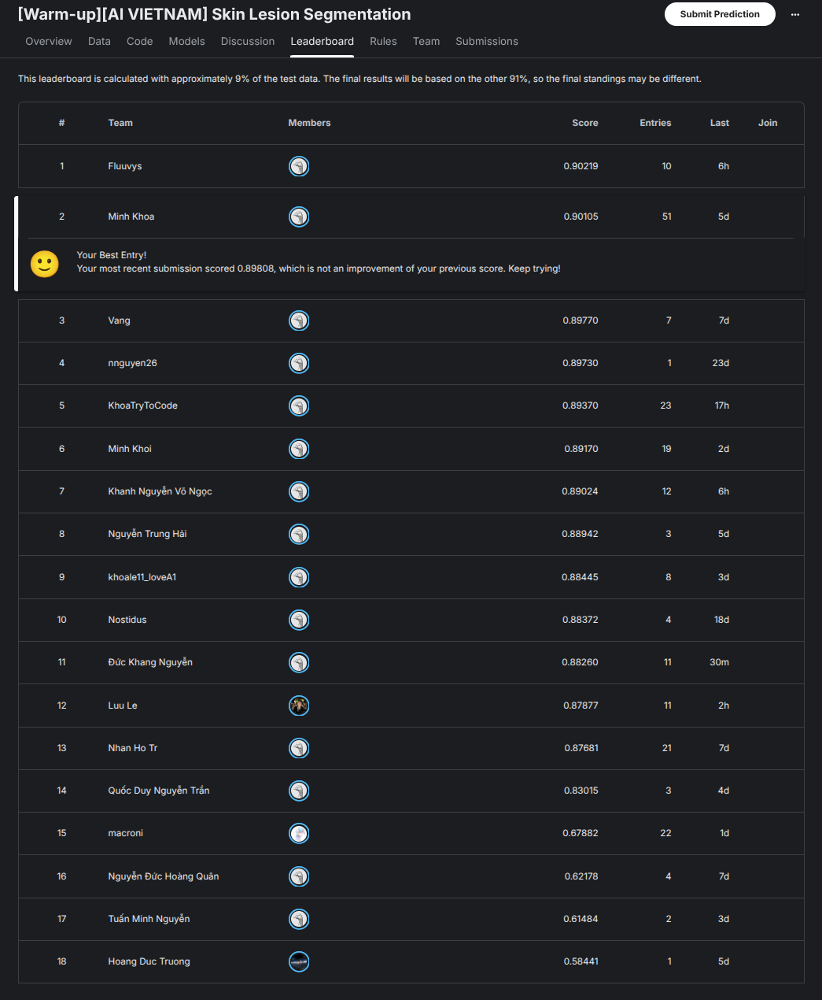

# [Warm-up][AI VIETNAM] Kaggle Challenge: Binary Skin Lesion Segmentation

## Description
This is a private challenge of **AIMA Warm-up reasearch program**, created to support participants in exploring and practicing Medical AI. The task focuses on **dermatoscopic skin images (2D)** with the objective of building an model for **binary skin lesion segmentation**

## Dataset 
The dataset includes dermatoscopic images with corresponding binary masks

- `Train/` → training images and their corresponding masks
- `Test/` → test images for submission

## Training
- Data preprocessing & augmentation: Random resized crop, random flip, color jitter, random brightness contrast, random coarse dropout
- Model: Pretrained U-net with Efficient-net b4 encoder backbone
- Loss function: Dice loss
- Optimizer: AdamW
- Evaluation: Dice score

## Submission Format
To meet file size constraints, **Run-Length Encoding (RLE)** is used to represent predicted masks:  
- Pixels are **1-indexed** and ordered **top-to-bottom, left-to-right**
- Example encodings:
  - `"1 3"` → pixels 1, 2, 3 belong to the mask
  - `"1 3 10 5"` → pixels 1, 2, 3, 10, 11, 12, 13, 14 belong to the mask

## Result:
Achieve 0.90105 public score (#2). This leaderboard is calculated with approximately 9% of the test data. The final results will be based on the other 91%, so the final standings may be different at the end of the challenge

